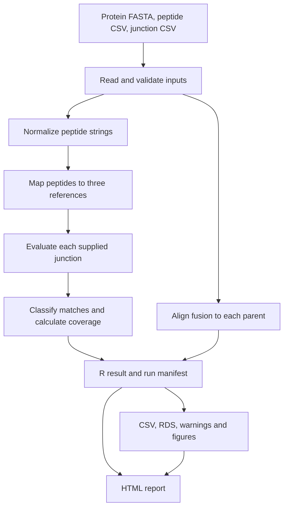

# Architecture

FusionPep is an R project with a command-line runner, reusable analysis functions, output writers, and an HTML renderer. This page describes the current code.

## Analysis and output flow

The runner checks the local environment, resolves inputs, performs analysis, writes data and figures, and renders the report. The arrows below show data dependencies; they do not imply parallel execution.



`run_fusion_analysis()` assembles the result without writing files. `write_fusion_outputs()` writes the data and figures; `write_fusion_report()` reads the result and saved paths to produce HTML. The renderer does not calculate the scientific classifications again.

## Source files and directories

- `R/fusion_mapper.R` contains input readers, validation, peptide normalization and matching, junction evaluation, coverage, pairwise alignment, plotting functions, and output writing. Plotting and file writing currently live beside the analysis functions in this file.
- `report/fusion_report.R` builds the HTML tables, annotated sequences, alignment views, figure embeds, manifests, navigation, and print styles.
- `run_fusion_mapper.R` resolves configuration and CLI paths, checks the local library, and calls the analysis and writers.
- `setup_renv.R` establishes the project-local library, installs dependencies with `pak`, and writes the lockfile snapshot.
- `check_project.R` checks the environment and source, runs tests, regenerates the example, and verifies outputs. It writes into `results/`.
- `input/` holds the bundled protein FASTA, peptide CSV, junction CSV, and detailed source notes. These are reference example inputs, not new experimental data.
- `tests/testthat/` contains tests for mapping, coordinates, normalization, junction decisions, coverage, alignments, figures, and report behavior.
- `renv/activate.R`, `renv/settings.json`, `renv.lock`, `.Rprofile`, and `.Renviron` define environment activation, dependency versions, and project-local cache settings.
- `wiki/` holds the maintained GitHub Wiki Markdown sources and copied example image.

The project name is FusionPep. Existing function names, result classes, runner paths, and output filenames remain the documented interfaces; for example, the runner is still `run_fusion_mapper.R` and the report filename is still `fusion_peptide_mapper_report.html`.

## Matching and summaries

Input readers retain source paths, file hashes, selected headers, and peptide metadata. Normalization produces the strings used for matching and records exclusions and transformations.

Peptide matching records every occurrence, including overlaps. Junction evaluation keeps one complete flank decision per crossing occurrence and supplied junction. Classification and plotting consume those decisions. Coverage merges mapped intervals so the same residue is counted once.

Global and local pairwise alignments compare the fusion with each parent. Gap-aware tables retain both sequences' coordinates and exact and I/L-equivalent comparisons. Raw alignment objects are optional; the tabular results remain available without them.

## Development checks

With the existing local environment active, run the tests from the project root:

```bash
Rscript -e 'testthat::test_dir("tests/testthat")'
```

Tests that write outputs use temporary directories. For a separate example run, use a new output directory such as `results/review` rather than overwriting a saved analysis.

`Rscript check_project.R` performs the full project check and regenerates files in `results/`. Preserve existing inputs and outputs before using it. Neither analysis nor the project check installs dependencies.

Documentation changes can be checked without rerunning scientific calculations. Check the stated behavior against the source and verify the affected links and examples.
