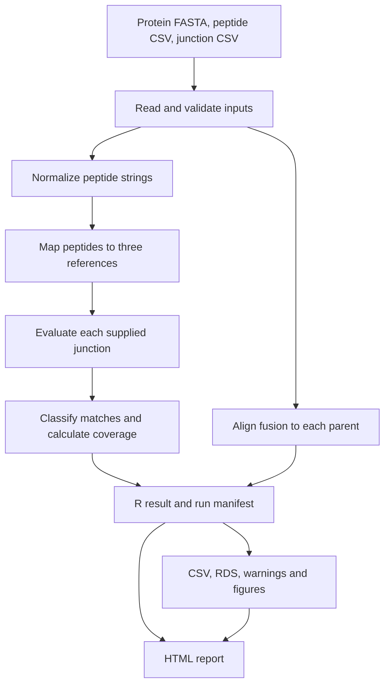

# Architecture

FusionPep is an R project with a command-line runner, reusable analysis functions, output writers, and an HTML renderer. This page describes the current code.

## Analysis and output flow

The runner checks the local environment, resolves inputs, performs analysis, writes data and figures, and renders the report. The arrows below show data dependencies; they do not imply parallel execution.



`run_fusion_analysis()` assembles the result without writing files. `write_fusion_outputs()` writes the data and figures; `write_fusion_report()` reads the result and saved paths to produce HTML. The renderer does not calculate the scientific classifications again.

## Source files and directories

- `R/fusion_mapper.R` contains input readers, validation, peptide normalization and matching, junction evaluation, coverage, pairwise alignment, the run manifest, and `run_fusion_analysis()`. It writes no files.
- `R/fusion_figures.R` draws the coverage, junction, and alignment figures from an analysis result and saves each as a PNG and a vector PDF.
- `R/fusion_outputs.R` defines the output filenames and writes the tables, RDS, warnings, and figures through a staging directory.
- `report/fusion_report.R` builds the HTML tables, annotated sequences, alignment views, figure embeds, manifests, navigation, and print styles.
- `run_fusion_mapper.R` resolves configuration and CLI paths, checks the local library, and calls the analysis and writers.
- `setup_renv.R` establishes the project-local library, and installs the versions pinned in `renv.lock` with `pak`. It writes a lockfile only when none exists.
- `check_project.R` checks the environment and source, runs tests, regenerates the example, and verifies outputs. It writes into `results/`.
- `input/` holds the bundled protein FASTA, peptide CSV, junction CSV, and detailed source notes. These are reference example inputs, not new experimental data.
- `tests/testthat/` contains tests for mapping, coordinates, normalization, junction decisions, coverage, alignments, figures, report behavior, and the command-line runner. `helper-fusionpep.R` loads the project code for every test file.
- `renv/activate.R`, `renv/settings.json`, `renv.lock`, `.Rprofile`, and `.Renviron` define environment activation, dependency versions, and project-local cache settings.
- `wiki/` holds the maintained GitHub Wiki Markdown sources and copied example image.

The project name is FusionPep. Existing function names, result classes, runner paths, and output filenames remain the documented interfaces; for example, the runner is still `run_fusion_mapper.R` and the report filename is still `fusion_peptide_mapper_report.html`.

## Matching and summaries

Input readers retain source paths, file hashes, selected headers, and peptide metadata. Normalization produces the strings used for matching and records exclusions and transformations.

Peptide matching records every occurrence, including overlaps. Junction evaluation keeps one complete flank decision per crossing occurrence and supplied junction. Classification and plotting consume those decisions. Coverage merges mapped intervals so the same residue is counted once.

Global and local pairwise alignments compare the fusion with each parent. Gap-aware tables retain both sequences' coordinates and exact and I/L-equivalent comparisons. Raw alignment objects are optional; the tabular results remain available without them.

## Development checks

With the existing local environment active, run the tests from the project root:

```bash
Rscript -e 'testthat::test_dir("tests/testthat")'
```

Tests that write outputs use temporary directories. For a separate example run, use a new output directory such as `results/review` rather than overwriting a saved analysis.

`Rscript check_project.R` performs the full project check: it parses every R file, applies the lint rules in `.lintr`, rejects installation and debugging calls in production code, runs the tests, runs the bundled example, and checks the outputs. It regenerates files in `results/`, so preserve existing outputs before using it. Neither analysis nor the project check installs dependencies.

Documentation changes can be checked without rerunning scientific calculations. Check the stated behavior against the source and verify the affected links and examples.

## Continuous integration and releases

The `CI` workflow runs on pushes and pull requests to `main`, and monthly against current package repositories:

- **Project check (Linux):** installs the locked dependencies with `setup_renv.R`, confirms that setup left `renv.lock` unchanged, checks release metadata, runs `check_project.R`, and requires at least 90% line coverage. The example report is kept as a run artifact.
- **Tests (macOS and Windows):** install the locked dependencies and run the test suite after the Linux check passes.
- **Workflow security:** audits the workflows with [zizmor](https://docs.zizmor.sh/). Actions are pinned to commit hashes, and Dependabot proposes updates monthly.
- **R dependencies:** Dependabot does not read `renv.lock`, so the monthly run lists locked packages that have newer versions in its job summary.

The package library is cached per operating system, R version, and lockfile, so a run after the first mainly measures the checks themselves.

Changes are recorded in `NEWS.md` under a `# fusionpep X.Y.Z` heading matching the `Version` in `DESCRIPTION` and `version` in `CITATION.cff`; CI fails when the three disagree. Between releases, the version can be a development version such as `0.1.0.9000` with a `# fusionpep (development version)` heading.

Nothing is released until a version tag is pushed. To release version `X.Y.Z`:

1. Set the version in `DESCRIPTION` and `CITATION.cff`, add `date-released` to `CITATION.cff`, and put the notes under `# fusionpep X.Y.Z` in `NEWS.md`.
1. Merge to `main` and wait for CI to pass.
1. Tag that commit and push the tag: `git tag -s vX.Y.Z && git push origin vX.Y.Z`.

The `Release` workflow then checks that the tag is on `main`, matches the version metadata, and has a passing CI run. It publishes a GitHub release with the NEWS section as notes and a source archive with its SHA-256 checksum.

The `Wiki` workflow validates `wiki/` on pull requests and mirrors it to the GitHub Wiki after a merge to `main`.

## Dependency changes

To change a dependency, install the new version into the project library with `pak::pkg_install()`, then record it with `Rscript -e 'renv::snapshot(type = "explicit")'` and review the `renv.lock` diff before committing. Setup never updates the lockfile on its own.
