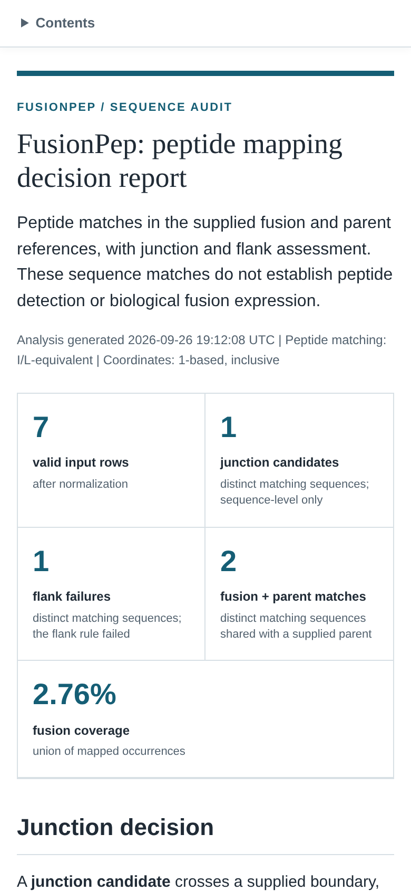
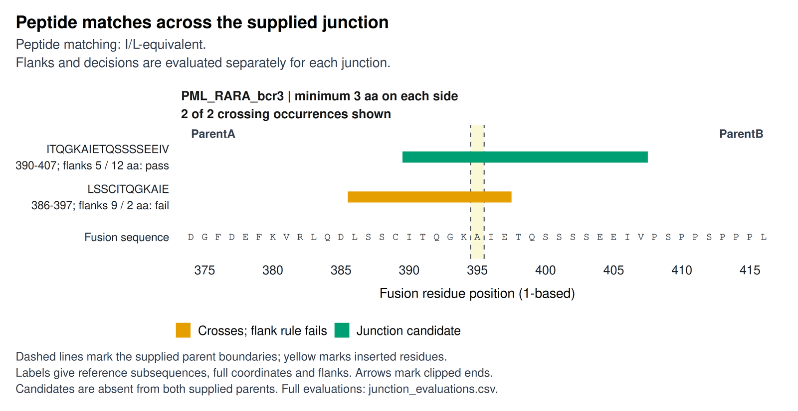
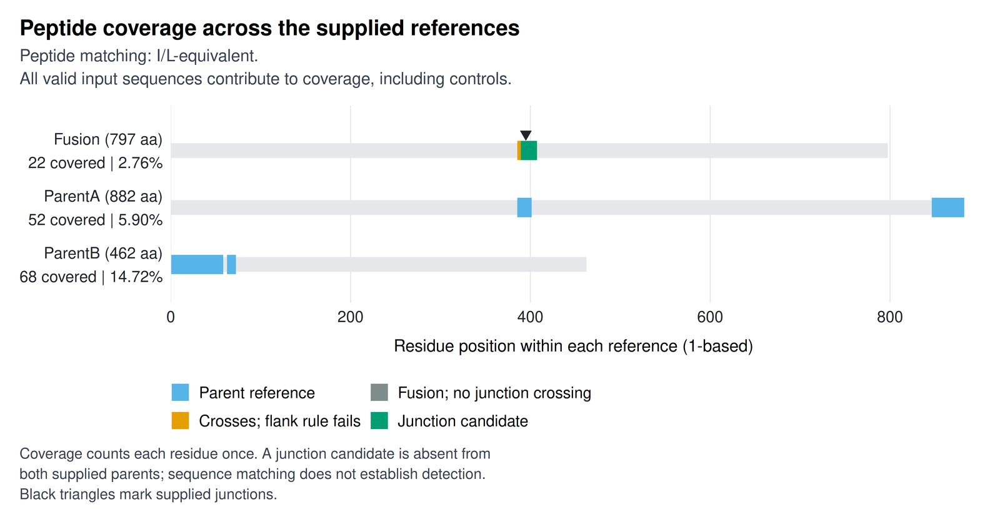
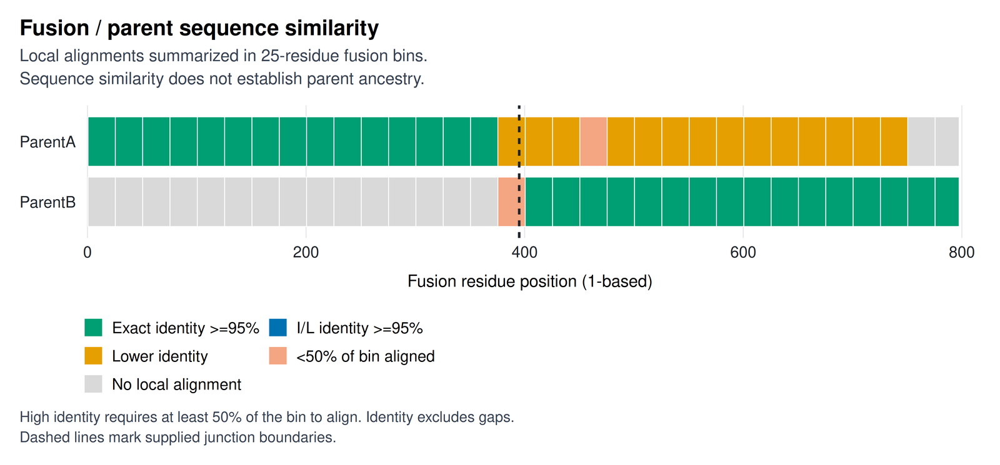

# Reports and figures

Open `fusion_peptide_mapper_report.html` in the chosen output directory. It contains the analysis summary, junction decisions, annotated sequences, alignments, coverage, figures, and input records.

The report embeds its figure images. Keep the output directory and `figures/` subdirectory together when sharing PDF and data-file links; those links point to neighboring files.

## Navigate the report

On desktop, the contents stay in a sidebar and indicate the section being read. On narrow screens, a compact contents menu stays near the top. Wide tables scroll horizontally.

The [worked example](Worked-Example) shows each report section for the bundled data.

Start with the summary and junction decisions. Expand annotated sequences and detailed alignments when you need residue-level inspection. Under **Inputs and manifests**, separate panels contain normalization notes, the run manifest, and the output manifest. The output manifest explains each data file and gives complete CSV row counts.

Report tables state when they omit rows. The non-match-region table displays at most 100 regions; other limited tables display up to 200 rows. Use the corresponding CSV for the complete data.

## Junction evidence figure

`figures/junction_evidence.png` and its matching PDF show peptide occurrences around each supplied junction. The figure keeps the two flank lengths, threshold, and decision together for each occurrence.

Each panel shows at most 12 crossing occurrences and states the displayed and total counts. Occurrences are ordered by decision class, then by the shorter flank (longest first), start position, and matching sequence. The view extends 20 residues from each boundary side. Arrows indicate peptide ends beyond the displayed window; labels retain their full inclusive coordinates.

Labels show reference subsequences, which can differ from input strings under I/L equivalence. Inserted residues are marked separately from the parent boundary residues. The full set of crossing evaluations remains in `junction_evaluations.csv`.

## Peptide coverage figure

`figures/peptide_coverage.png` and its PDF place occurrences on each reference's own coordinates. Bars include both endpoints, so a single-residue match still has visible width. Stronger junction interpretations are drawn on top where categories overlap.

Coverage includes every valid input sequence, including controls. Consult `peptide_hits.csv` for occurrences hidden beneath an overlapping bar and `coverage_summary.csv` for the union coverage measurements.

## Alignment overview figure

`figures/alignment_status.png` and its PDF summarize local fusion-to-parent similarity in 25-residue bins on the fusion coordinates. The categories use the following rules:

| Color | Meaning |
| --- | --- |
| Green | At least 95% exact identity, with at least 50% of the bin aligned |
| Blue | At least 95% I/L-equivalent identity, exact identity below 95%, and at least 50% aligned |
| Orange | Lower identity among bins with at least 50% aligned |
| Salmon | Some alignment, but less than 50% of the bin aligned |
| Grey | No local alignment in the bin |

Identity excludes gaps. The figure summarizes similarity and does not establish ancestry. Read `alignment_columns.csv` for the full gap-aware coordinates and `alignment_summaries.csv` for the alignment measurements.

## Export and print

Every figure is written as a vector PDF and a PNG at a requested width of 180 mm. PNG export uses 600 dpi. The images on this page are reduced web copies of the example's figures. Figure text, captions, and legends are sized for that width.

Choose the journal's required final dimensions before submission. Resizing a figure also changes text size. Inspect the PDF at its final printed size and check that labels, categories, and captions remain readable.

The HTML report includes print styles. Open the detail panels you want to include before printing: closed panels are omitted from the printout. Use the figure PDFs for individual manuscript figures and the HTML print view for a report containing the selected details.

## Data files and run records

The tables retain complete data when a figure or report table displays only a subset. The manifest panels in the report link these files and explain their contents.

Data files and what they contain

| File | Contents |
| --- | --- |
| `input_peptides.csv` | Original peptide table and retained metadata columns |
| `normalized_peptides.csv` | Input row IDs, normalized strings, status, and notes |
| `fusion_junctions.csv` | Validated supplied junction definitions |
| `peptide_hits.csv` | All mapped occurrences, coordinates, input row IDs, and display classes |
| `junction_evaluations.csv` | Every crossing occurrence/junction pair and its complete flank decision |
| `peptide_summary.csv` | Per-matching-sequence presence and junction evidence summaries |
| `coverage_summary.csv` | Reference lengths, covered residues, and coverage percentages |
| `uncovered_regions.csv` | Inclusive intervals with no mapped peptide coverage |
| `alignment_columns.csv` | Gap-aware residue coordinates for global and local alignments |
| `alignment_regions.csv` | Consecutive alignment runs by match, mismatch, or gap status |
| `alignment_summaries.csv` | Alignment scores, identities, and aligned fractions |
| `sequence_metadata.csv` | Selected reference roles, source headers, and lengths |
| `run_manifest.csv` | Generation time, input file names and hashes, versions, and settings |
| `warnings.txt` | Normalization warnings, or a line stating there were none |
| `fusion_peptide_mapper_result.rds` | Structured R result, readable with `readRDS()` |

CSV row counts exclude the header. `input_row_ids` refer to rows in the original peptide table, also excluding its header. See [Interpreting results](Interpreting-Results) for the links between occurrence and junction-evaluation rows.

The run manifest records the input file names and MD5 hashes, selected sequence identifiers, peptide column, I/L setting, alignment settings, R version, and reported package versions. Saved files identify inputs by file name and hash, not by directory, so a shared output directory does not reveal where the inputs were stored. Retain the original input files and `renv.lock` with a run when you need to reproduce it.

Use the [R interface](R-Interface) to inspect the result object or produce a report from an analysis in your own script.
