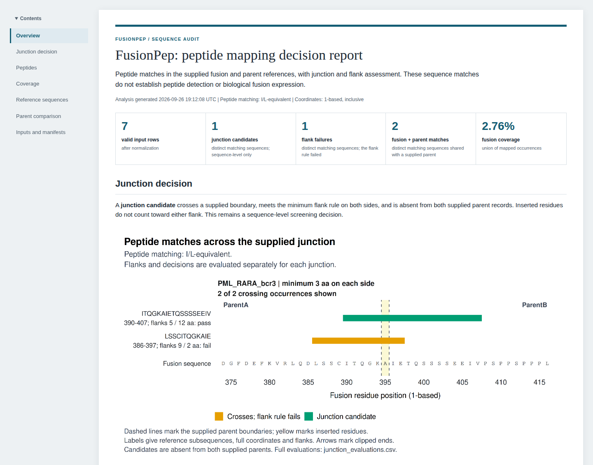
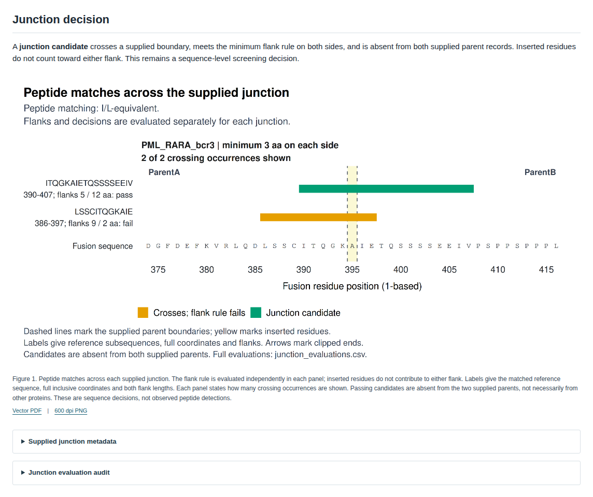
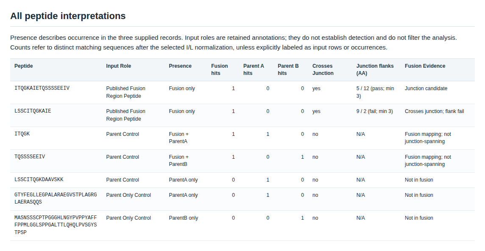
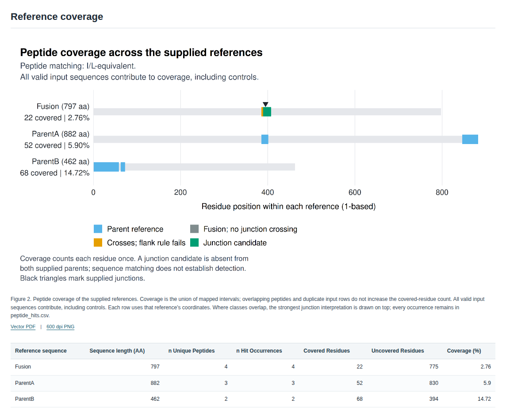
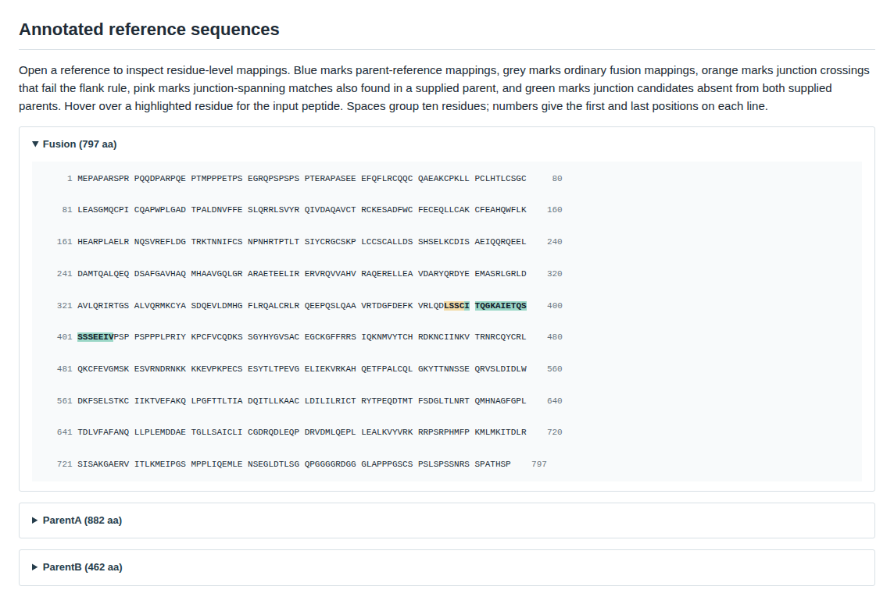
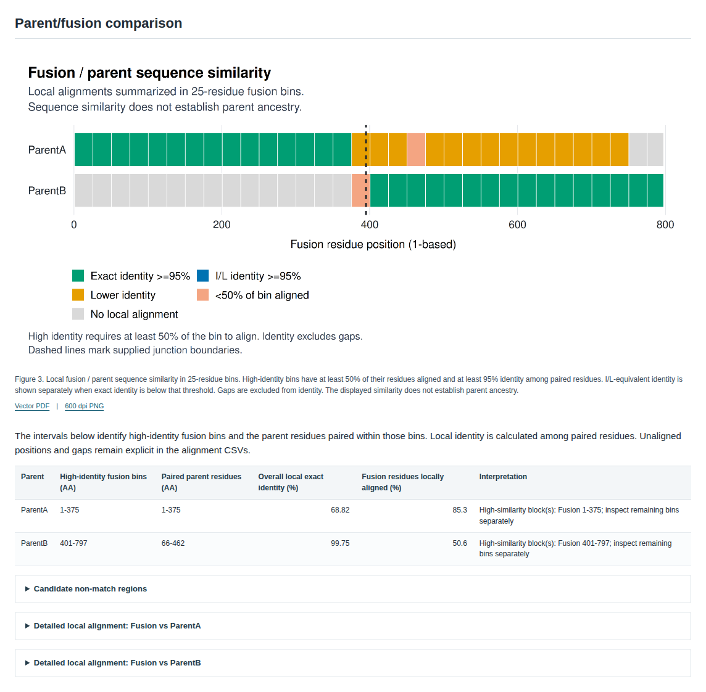
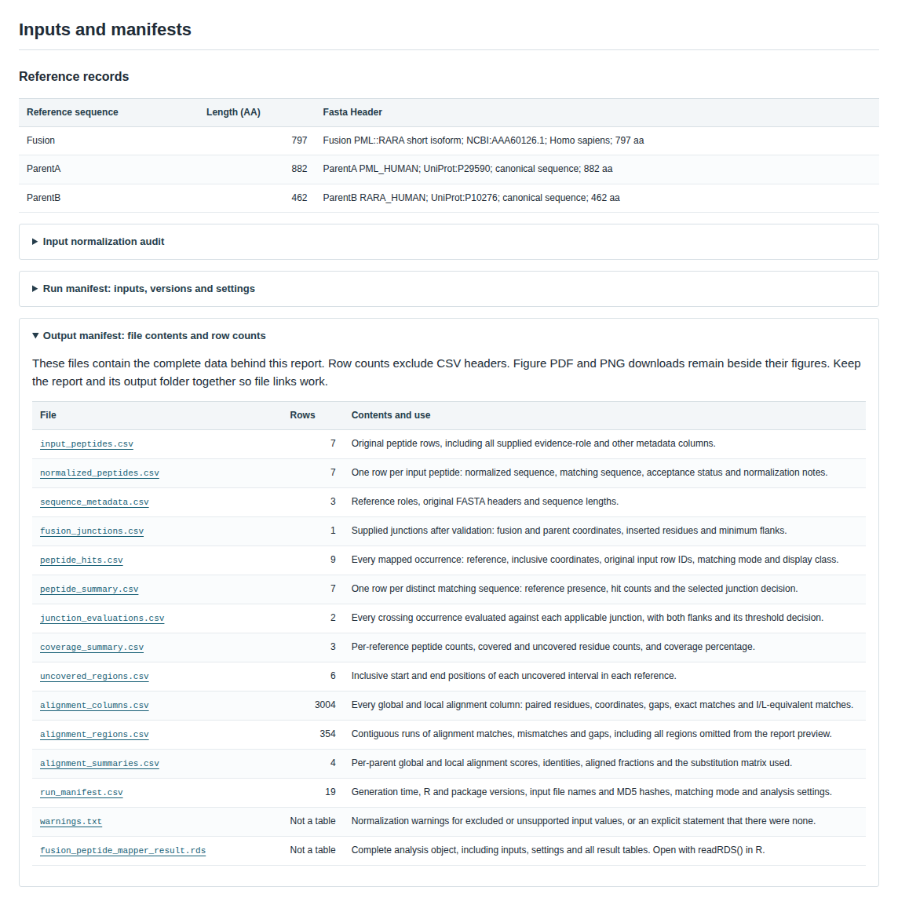

# Worked example

The bundled files demonstrate mapping against a supplied human PML::RARA fusion reference. The peptide table contains reference sequences and parent controls. These are not PSMs acquired or validated by FusionPep.

After completing [setup](Getting-Started), run from the project root:

```bash
Rscript run_fusion_mapper.R --output=results/example
```

Open `results/example/fusion_peptide_mapper_report.html`. This page walks through that report section by section. The measurements describe the bundled input files with I/L-equivalent matching and the supplied minimum of three residues on each junction side.

Without running anything, you can download the complete example output (report, figures, tables, and R result) as the `fusionpep-demo` artifact of the latest [Demo workflow run](https://github.com/LangeLab/FusionPep/actions/workflows/demo.yml). The screenshots on this page come from the same build.



The report opens with the question it answers. The summary counts give the valid input rows, the junction candidates and flank failures (distinct matching sequences), the matches shared with a supplied parent, and the fusion coverage. The contents sidebar follows you through the sections below.

## References and supplied join

The FASTA contains these selected records:

| Role      | Reference label      | Accession    | Length (aa) |
| --------- | -------------------- | ------------ | ----------: |
| `Fusion`  | PML-RAR protein      | `AAA60126.1` |         797 |
| `ParentA` | Canonical human PML  | `P29590`     |         882 |
| `ParentB` | Canonical human RARA | `P10276`     |         462 |

The supplied junction, `PML_RARA_bcr3`, sets the fusion's left boundary at residue 394 and its right boundary at residue 396. Residue 395 is an inserted alanine. The supplied corresponding parent coordinates are PML residue 394 and RARA residue 61.

Source records are [NCBI AAA60126.1](https://www.ncbi.nlm.nih.gov/protein/AAA60126.1), [UniProt PML P29590](https://www.uniprot.org/uniprotkb/P29590), and [UniProt RARA P10276](https://www.uniprot.org/uniprotkb/P10276). The fusion input's source cDNA record is [M73779.1](https://www.ncbi.nlm.nih.gov/nuccore/M73779.1). The repository's `input/README.md` retains the detailed source notes and literature references.

## Report tour

### Junction decision



The first section answers the main question. Both of these occurrences cross the supplied boundary:

| Input peptide        | Fusion interval (aa) | Left flank (aa) | Right flank (aa) | Flank rule |
| -------------------- | -------------------- | --------------: | ---------------: | ---------- |
| `ITQGKAIETQSSSSEEIV` | 390-407              |               5 |               12 | Pass       |
| `LSSCITQGKAIE`       | 386-397              |               9 |                2 | Fail       |

For the first peptide, the left flank is `394 - 390 + 1 = 5`, and the right flank is `407 - 396 + 1 = 12`. Both meet the minimum of three. The peptide is also absent from the two supplied parents under the selected matching mode, so the result is `junction_spanning_candidate`.

The second peptide has nine residues on the left but only two on the right. It receives `junction_crossing_below_flank_threshold`. The longer left flank does not make the right flank sufficient.

The figure in this section is `figures/junction_evidence.png`. It shows the bundled example under the settings above. The dashed boundaries and inserted alanine explain the flank counts. The figure labels display matched reference subsequences; under I/L equivalence, those labels can differ from the input peptide letters shown in the table.

`LSSCITQGKAIE` appears as a predicted PML-RARA peptide in Table II of [Conlon et al. (2013)](https://pmc.ncbi.nlm.nih.gov/articles/PMC3790285/). The CSV attributes `ITQGKAIETQSSSSEEIV` to [Gambacorti-Passerini et al. (1993)](https://doi.org/10.1182/blood.v81.5.1369.bloodjournal8151369), but its exact transcription from that paper remains unconfirmed. Use it as a supplied reference peptide; the `published_fusion_region_peptide` input label does not verify that attribution.

The classifications above are FusionPep's sequence calculations with the supplied references and rule; they are not an assessment of the original experimental evidence.

### All peptide interpretations



One row per distinct matching sequence gives its presence in the three references, the hits in each, both junction flanks, and the resulting evidence class. The two parent-only controls confirm that parent sequences map where expected and are not reported in the fusion.

### Reference coverage



The seven input rows produce nine mapped occurrences across the three references. Four of those occurrences are in the fusion, and two cross the supplied junction.

Coverage uses the union of all mapped intervals, including the parent-control rows:

| Reference | Covered residues (aa) | Sequence length (aa) | Coverage (%) |
| --------- | --------------------: | -------------------: | -----------: |
| Fusion    |                    22 |                  797 |         2.76 |
| ParentA   |                    52 |                  882 |         5.90 |
| ParentB   |                    68 |                  462 |        14.72 |

These values do not describe experimentally observed sequence coverage. They describe the supplied reference and control peptide strings.

### Annotated reference sequences



Each reference opens as a numbered residue listing. Mapped residues take the color of their evidence class; hovering over one shows the input peptide. In the fusion, the failing peptide (orange, 386-397) and the junction candidate (green, 390-407) overlap across the inserted alanine at residue 395; where classes overlap, the stronger interpretation is shown.

### Parent/fusion comparison



The alignment figure places the fusion's local similarity to each parent in 25-residue bins. Here ParentA (PML) matches the fusion's first 375 residues and ParentB (RARA) residues 401-797, with the junction between them. The detailed alignment panels list every paired residue.

### Inputs and manifests



The last section records the reference headers and, in closed panels, the normalization notes, the run manifest (input hashes, versions, and settings), and the output manifest. The output manifest links every saved file with its row count and contents.

## Follow a decision back to its input

1. Find a peptide in `peptide_summary.csv` and read its presence and junction evidence classes.
1. Find its occurrences and `input_row_ids` in `peptide_hits.csv`.
1. Use `hit_row_id` in `junction_evaluations.csv` to inspect the corresponding occurrence's full flank pair and threshold.
1. Read the original peptide and metadata in `input_peptides.csv` and its normalization notes in `normalized_peptides.csv`.
1. Read the matching settings and input hashes in `run_manifest.csv`.

See [Interpreting results](Interpreting-Results) for the classification rules and [Reports and figures](Reports-and-Figures) for all saved files.
